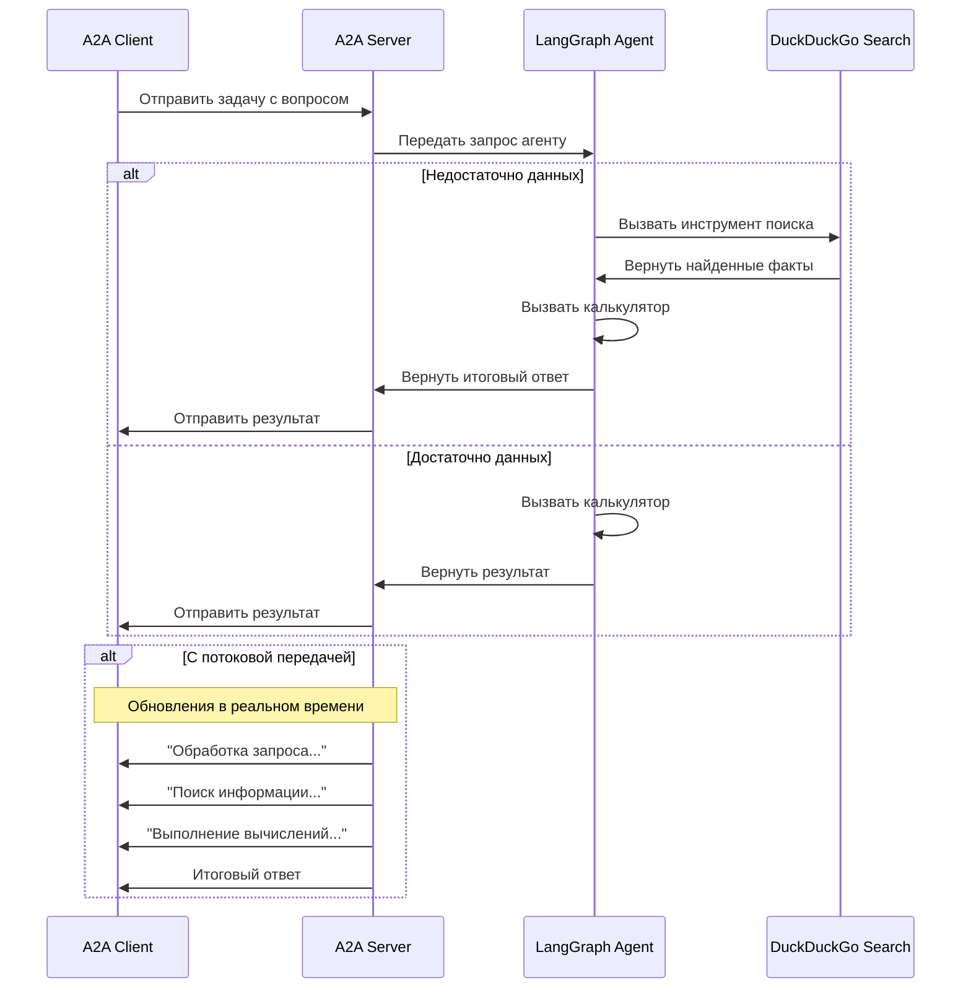

# LangGraph Math & Search Agent с A2A-протоколом

Этот пример демонстрирует агента для решения реальных математических задач, созданного с помощью [LangGraph](https://langchain-ai.github.io/langgraph/) и совместимого с A2A-протоколом. Агент умеет выполнять поиск фактов в интернете и проводить математические вычисления, поддерживая многоходовые диалоги и потоковые (streaming) ответы.

## Демонстрацию работы агента

http://178.72.139.235:8501/

## Как это работает

Агент использует LangGraph и LLM (например, OpenAI GPT-4o) для решения задач по следующему сценарию:
1. Если в запросе не хватает данных (например, скорость гепарда или длина моста), агент вызывает инструмент поиска.
2. Получив числовые данные, агент вызывает инструмент-калькулятор для вычисления результата.
3. A2A-протокол обеспечивает стандартизированное взаимодействие с агентом, позволяя клиентам отправлять запросы и получать обновления в режиме реального времени.



## Ключевые возможности

- **Поиск в интернете**: интеграция с DuckDuckGo для получения реальных данных (скорости, расстояния и т.д.)
- **Математические вычисления**: безопасный калькулятор для арифметических операций
- **Многоходовые диалоги**: агент поддерживает контекст между запросами
- **Потоковая передача**: отправка промежуточных статусов во время обработки
- **Чёткий формат ответа**: финальный ответ содержит только результат с ключевыми фактами и расчётом

## Предварительные требования

- Python 3.12
- Доступ к LLM (например, OpenAI) и API-ключ

## Установка и запуск

1. Перейдите в директорию проекта:

   ```bash
   cd agent_for_ingo
   ```

2. Создайте файл `.env` с вашим API-ключом:

   ```bash
   echo "OPENAI_API_KEY=ваш_openai_api_key" > .env
   echo "PROXY_URLS=https://ваш-прокси-url" >> .env
   ```

3. Установите зависимости (с помощью UV, рекомендуется):

   ```bash
   pip install -r requirements.txt
   ```

4. Запустите агент:

   ```bash
   # Запуск на порту по умолчанию (10000)
   python -m app

   ```

5. В отдельном терминале запустите тестовый клиент:

   ```bash
   python app/test_client.py
   ```

6. Запустите веб-интерфейс на Streamlit:

   ```bash
   streamlit run chat_ui_a2a.py
   ```

## Примеры запросов

**Простой запрос**
> Сколько секунд нужно гепарду на полной скорости, чтобы пробежать по Большому Каменному мосту?

**Многоходовый диалог**
1. Пользователь: _"Меня зовут Денис"_
2. Пользователь: _"Как меня зовут?"_
3. Агент: _"Денис"_

**Ожидаемый формат ответа**
```
5.17 seconds (leopard speed: 29 m/s, Bolshoy Kamenny Bridge length: 150 m, calculation: 150 / 29 = 5.17)
```

## Техническая реализация

- **LangGraph Agent**: многошаговый агент с поддержкой инструментов
- **Инструменты**: `search_web` (DuckDuckGo) и `calculator` (безопасные вычисления)
- **Память**: `MemorySaver` для сохранения контекста диалога
- **A2A-совместимость**: полная поддержка протокола, включая streaming и multi-turn

## Ограничения

- Поддерживает только текстовые входные и выходные данные
- Поиск зависит от внешнего API DuckDuckGo и может быть нестабильным
- Память сессии не сохраняется после перезапуска сервера

## Узнать больше

- [A2A Protocol Documentation](https://a2a-protocol.org/)
- [LangGraph Documentation](https://langchain-ai.github.io/langgraph/)
- [DuckDuckGo Search API](https://pypi.org/project/duckduckgo-search/)
